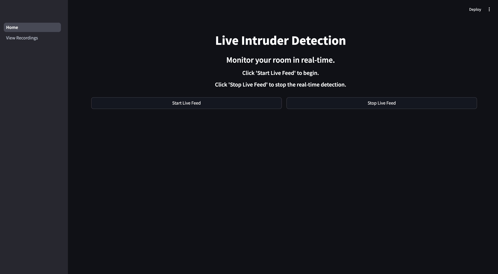

# indoor-surveillance-system
This project is a home security system that uses motion detection to identify intruders and send real-time alerts. The system captures video footage when movement is detected, classifies the intruder (e.g., big or small object), and uploads the recordings to a web dashboard for review.

Key Features:

✅ Real-time Motion Detection – Captures video clips when movement is detected.

✅ Intruder Classification – Determines if the intruder is a big or small object.

✅ Email Alerts – Sends notifications with metadata (e.g., timestamp, location of movement).

✅ Web Dashboard – Allows users to view, manage, and delete recorded clips.

The goal is to create an efficient and user-friendly security system that enhances indoor surveillance. 🚀


## App workflow
1. App home page


2. Start video live stream


3. Motion detection


4. View page storing all video recordings and metadata


5. Watch a recording video


## Pre-requisites

### Install requirements
- create a new python venv

```pip install -r requirements.txt```

### Email setup
- create a .env file
- set your gmail username
- assuming your gmail has 2FA, you need to create an app password. This will be the password you set as password in the .env file.
  - Refer to https://support.google.com/mail/answer/185833?hl=en
- in the .env file, add the following
  - SENDER_EMAIL = '-your gmail address-'
  - SENDER_PASSWORD = '-your app password created above-'
 
### App variables - change these according to your needs
- set recipient_email = '-your own gmail address or another address you want to send notifications to-'
- final_width = 1280 # size of the video display, dont need to change
- final_height = 720 # size of the video display, dont need to change
- binary_threshold = 100 # change this according to different lighting conditions
- min_contour_area_to_trigger_detection = 10000 # change this to change the minimum bounding box area required to trigger detection (detection is triggered whenever you see a red bounding box on the screen)
- max_small_object_area = 2500 # this is a threshold btwn considering if an object is considered small or big object

## To run the app, do
```streamlit run Home.py```

## Notes
- App works best with current variables in darker room conditions, then use something bright as a 'moving object'. Example dim lights in your room and switch on your phone flashlight and move the phone across your screen. If its too sensitive, increase binary_threshold parameter.
